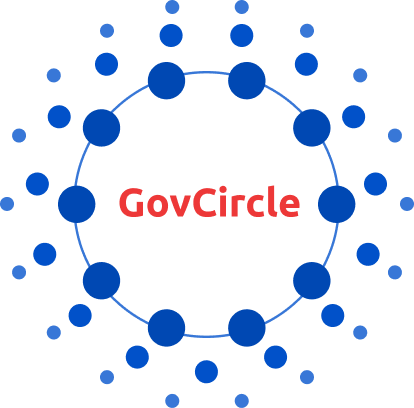

# GovCircle Website Repository

  

## 🚀 The Infrastructure for Trustless Organizational Agility

This repository contains the source code for the official GovCircle website. GovCircle is a comprehensive governance framework designed to solve the structural rigidity and governance paralysis facing large-scale Decentralized Autonomous Organizations (DAOs).

---

## 💡 About GovCircle

GovCircle is more than a simple voting mechanism; it is the **technical operating system** required to implement structured, scalable, and resilient governance on the Cardano ecosystem.

As DAOs mature, basic token-voting mechanisms often fail, leading to slow execution and opaque decision-making. We provide the necessary infrastructure for next-generation decentralized communities to achieve:

* **Scale Without Gridlock:** Implementing delegated authority and structured roles for efficient, parallel execution.
* **Clear Accountability:** Defining immutable principles and decision pathways, verifiable on-chain.
* **Future-Proof Governance:** Utilizing a modular architecture that allows the organization to evolve while maintaining the integrity of its core rules.

GovCircle is committed to enhancing decentralized decision-making across Cardano, with a focus on integrating privacy solutions via the **Midnight Ecosystem**.

## 🔗 Quick Links

| Resource | Description |
| :--- | :--- |
| **Live Website** | [The public-facing site](https://govcircle.space) |
| **Circle Paper (Documentation)** | [In-depth technical and architectural documentation](https://govcircle.gitbook.io/circle-paper) |
| **X (Twitter)** | [Official project updates and community engagement](https://x.com/govcircle_space)|
| **GitHub Organization** | [Main home for all GovCircle code repositories](https://github.com/govcircle) |

*Note: Please update the placeholders above with the final deployment URL and social links.*

---

## 💻 Repository Purpose

This repository is dedicated solely to the public-facing **GovCircle Marketing and Information Website**.

It contains all front-end code, assets, and configurations necessary to deploy the official website, serving as the first point of contact for the community to learn about our mission, vision, and core technical framework.

### Technologies Used

| Technology | Purpose |
| :--- | :--- |
| **[Framework/Library]** | [React, Hugo] |
| **[Styling]** | [Tailwind CSS, Styled Components] |
| **[Hosting]** | [Github Page] |

---

